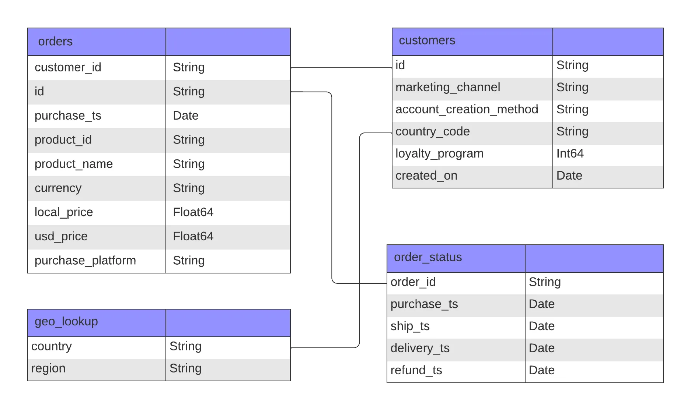
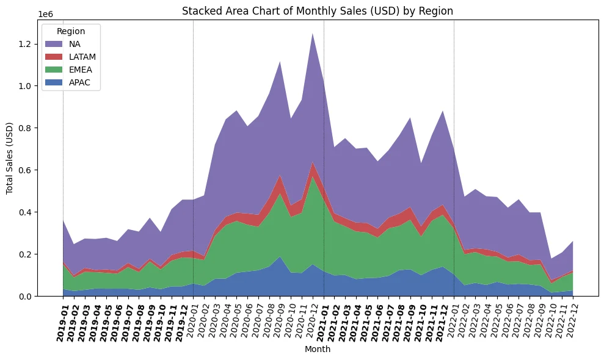
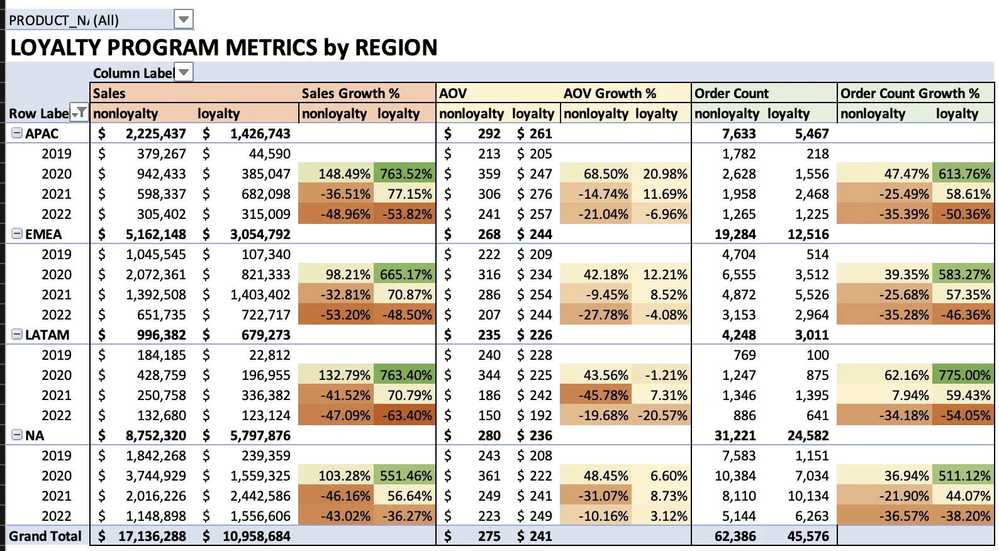

# ByteX Post-Pandemic Analysis

> For more of my projects and data journey, visit my [Portfolio](https://ruizdelcarmen.me/).

Table of Contents

- [Project Background](#project-background)
- [Executive Summary](#executive-summary)
- [Insights Deep-Dive](#insights-deep-dive)
    - [Sales Trends and Growth Rates](#sales-trends-and-growth-rates)
    - [Key Product Performance](#key-product-performance)
    - [Loyalty Program Performance](#loyalty-program-performance)
    - [Sales by Platforms & Channels](#sales-by-platforms--channels)
    - [Refund Rate Trends](#refund-rate-trends)
- [Actionable Recommendations](#actionable-recommendations)
    - [Maximizing Product Offerings](#maximizing-product-offerings)
    - [Loyalty Program Enhancements](#loyalty-program-enhancements)
    - [Maintaining Low Refund Rates](#maintaining-low-refund-rates)
    - [Optimizing Channels and Platforms](#optimizing-channels-and-platforms)
    - [Regional Growth Strategies](#regional-growth-strategies)
- [Assumptions and Caveats](#assumptions-and-caveats)

## Project Background

ByteX, a global e-commerce company founded in 2018, specializes in selling popular electronics like Apple, Samsung, and ThinkPad products. Despite rapid growth, their core datasets—orders, customers, and products—are disorganized, leaving valuable insights unexplored. As a data analyst, I’m partnering with the Head of Operations to extract insights and deliver recommendations to improve performance across finance, sales, product, and marketing teams.

## Executive Summary

This analysis of 108,000 ByteX orders from 2019 to 2022 reveals key trends to inform strategic actions. ByteX averaged $7 million in annual sales, with a sharp 2020 pandemic surge, followed by a 45% decline by 2022, stabilizing above pre-pandemic levels. North America and EMEA remain the strongest markets, contributing 80% of sales, while APAC and LATAM showed volatility despite rapid growth in 2020. Laptop sales, particularly MacBooks and ThinkPads, surged during the pandemic but have since slowed. The loyalty program has boosted customer engagement and revenue but has lost momentum post-pandemic.

To maintain growth, ByteX should focus on expanding its top-performing products, optimizing the loyalty program, and prioritizing North America and EMEA. Additional opportunities include stabilizing APAC and LATAM markets, improving refund rates, and expanding affiliate marketing.

ByteX Dataset ERD

## Insights Deep-Dive

### Sales Trends and Growth Rates

ByteX averages $7 million in annual sales and 27,000 orders per year. Sales surged in 2020 due to the pandemic but declined by 45% by 2022, returning to just above pre-pandemic levels as physical stores reopened. ByteX shows seasonality, with peak sales in November and December and lower sales in February and October. North America and EMEA contribute 80% of sales, with the U.S. alone accounting for 50%. APAC and LATAM experienced an astounding +200% growth in 2020 but have remained volatile.

### Key Product Performance

During the pandemic, laptop sales soared, with MacBook orders growing by 400% and ThinkPad by 220%. However, this trend has since reversed. Four products–monitors, AirPods, and laptops–generate 96% of revenue, with AirPods making up 45% of all orders. Monitors lead in total revenue, contributing $9.8 million (35% of sales) from 2019 to 2022. The Samsung Cable Pack represents 20% of orders but only 2% of revenue, likely due to its low price or promotional use.

### Loyalty Program Performance

Loyalty members make their first purchase from account creation 20 days earlier than non-loyalty members (50 days vs. 70). Post-pandemic, loyalty metrics surged but slowed by 2022. Loyalty members now lead in several metrics, generating $500K more revenue, spending $30 more per order, and placing 500K more orders than non-loyalty members. The program performs well in North America, but APAC and LATAM remain volatile, indicating a need for targeted strategies in those regions.

### Sales by Platforms & Channels

Direct channels account for 83% of ByteX’s sales, while social media contributes 1% and affiliate channels 3%. Affiliates have the highest AOV at $303, with email campaigns at the lowest ($181). The website generates 97% of sales with an AOV of $304, while the mobile app lags with an AOV of $47. Further considerations on channel performance are covered in the assumptions and caveats section.

### Refund Rate Trends

Refund rates for high-ticket items peaked during the early pandemic but have since stabilized at 4-6%. In 2021, refunds decreased across all products compared to the the previous two years. Laptops had the highest refund rates in 2019 and 2020 (17%) but have since fallen to 6-9%, aligning with other product categories.

## Actionable Recommendations

### Maximizing Product Offerings

Monitors, AirPods, and laptops dominate sales and perform consistently across all regions.
- **Recommendation**: Expand catalogue variations in these categories to meet diverse customer needs, such as different screen sizes or premium models, to drive repeat purchases and strengthen market presence.

The Samsung Cable Pack makes up 20% of orders but only 2% of revenue, highlighting an opportunity for optimization.
- **Recommendation**: Reevaluate pricing, bundle with high-value items, or offer as a promotional gift to boost average order value (AOV).

### Loyalty Program Enhancements

While ByteX attracts new buyers, loyalty member conversion has been inconsistent and downward trends in program performance after 2020.

- **Recommendation**: Use targeted onboarding campaigns offering first-purchase discounts or early access. Tiered rewards can incentivize frequent purchases and improve retention. **Continuously monitor these metrics before making any final decisions on the program’s future, allowing for data-driven refinements.**

### Maintaining Low Refund Rates

In 2021, refund rates dropped significantly, aligning with customer expectations.

- **Recommendation**: Replicate successful practices from that period; product descriptions, quality control, or post-purchase support to maintain this trend.

### Optimizing Channels and Platforms

Affiliate marketing offers high AOV but accounts for only 3% of sales, holding untapped potential.
- **Recommendation**: Expand affiliate partnerships or increase commissions to attract influential marketers, boosting brand reach and AOV.

The website remains the highest-grossing sales channel, but the mobile app lags behind.
- **Recommendation**:  If resources permit, improve the mobile app experience by simplifying checkout, personalizing the experience. With mobile usage trends increasing, these adjustments could increase its contribution to total sales.

### Regional Growth Strategies

North America and EMEA generate 80% of sales, making them critical markets for sustained growth. However, regions like APAC and LATAM show potential despite their volatility.

- **Recommendations**:
    - Continue to focus resources on North America and EMEA through regionalized marketing campaigns and ensure product availability aligns with local consumer preferences.
    - For APAC and LATAM, consider leveraging localized partnerships or promotions that speak to the cultural and economic conditions of each region. These markets may require more tailored approaches, but with the right strategies, ByteX can capture their growth potential and stabilize sales performance.

## Assumptions and Caveats

- No recorded refunds for the entire year of 2022, which appears unusual and may warrant further investigation.
- There is a deterministic relationship between marketing channel and account creation method, with each marketing channel tied exclusively to a specific account creation method. This lack of variation may need attention from the data engineering team.
- I am unsure of how the loyalty program variable relate to the specific order record. Is the loyalty program variable tied to the user's account, or to the specific order itself? Is it possible for a user to be a loyalty member for one order and not for another? This would affect the accuracy of the loyalty program performance metrics.
- Direct and email marketing drive the majority of sales, but I am unsure of how exactly these relate to the loyalty program further because of the seemingly deterministic relationship of *a channel* to *an account* to *an order*.
    - Assuming that the marketing channel is truly the way the customer opened the site to make a purchase, the email channel has the highest loyalty member rate at 58%, while the direct channel has the highest loyalty member count at 32,906 (72% of all loyalty members). 
        - This would give us a hint as to which channels to hone in on to ensure loyalty program success moving forward.
- With this, these are the columns I would pursue clarity on by asking the relevant teams:
    - `marketing_channel` and `account_creation_method` in the `customers` table
        - How is this recorded and what does it represent exactly in the context of the data? 
        - Why do these columns have a deterministic relationship?
    - `loyalty_program` in the `customers` table
        - What is the boundaries of this variable? Is it tied to the user's account or to the specific order itself?
        - Is it possible for a user to be a loyalty member for one order and not for another? (Is the loyalty program a subscription or a one-time sign-up?)

***

- See the raw data and my cleaning, analysis, and pivot tables in the [Excel workbook](Exploration/bytex_ecommerce_analysis.xlsx).
- See my SQL queries in the [SQL file](Exploration/ecommerce_exploration.sql).
- See the Python Notebook for some sample data cleaning, visualization, and analysis in the [Jupyter Notebook](Exploration/ecommerce_exploration.ipynb).
- For more of my projects and data journey, visit my [portfolio website and reach out](https://ruizdelcarmen.me/)!
